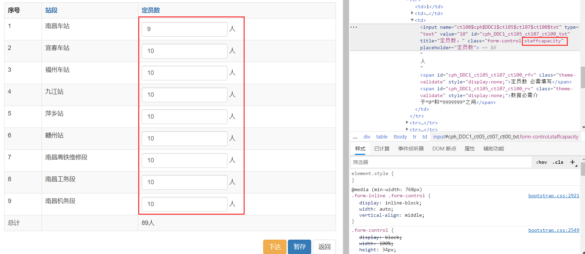
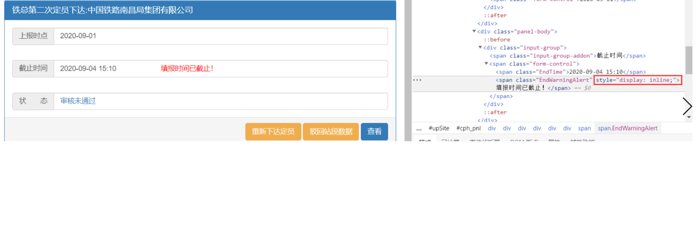
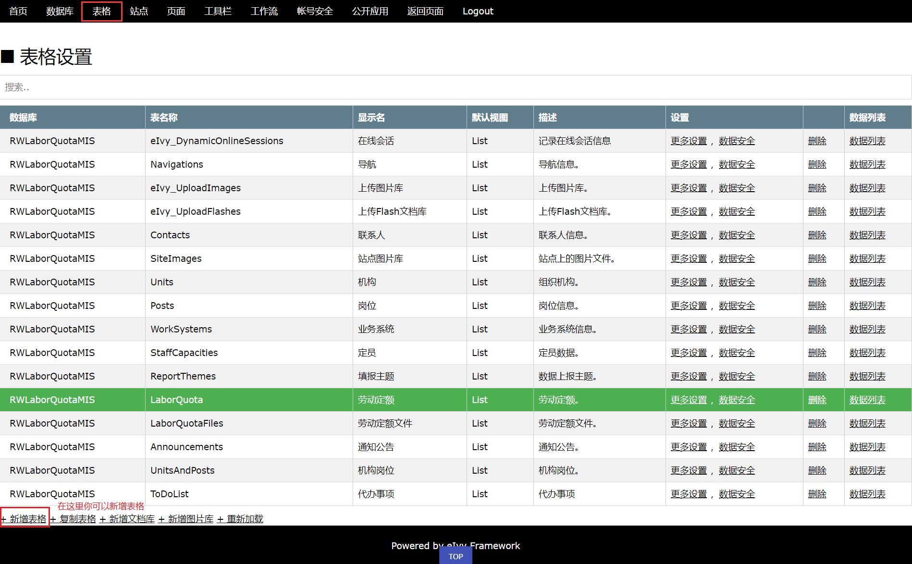
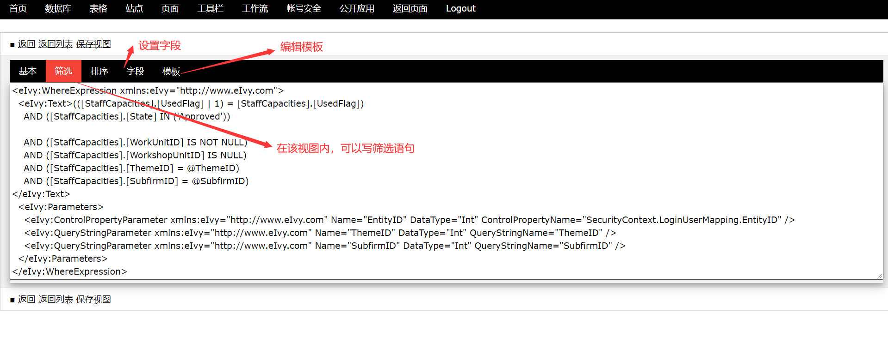

# <div style="height:40px"><div style="float:left">eIvy Framework 开发者博客</div> <div style="float:right"></img></div></div>
> ## 一、前端
>> ### （一）JS  
>>> #### (1) JS统计表格数据:  
    

图1：JS统计表格数据  
　 在统计表格数据之前，我们首先要明确要统计哪一行或哪一列的数据，例如上图，我们需要统计定员数这一列的数据总和。为了便于选择器选择，因此，我们为这一列加上特定
的类名"staffcapacity"。

　　首先,设定一个触发事件,这里我们设定为change事件。当输入框为空时,它的值类型为NaN,是无法进行加法运算的,这里我们先遍历一边数据,当数据为空时,让它默认等于0,这样就能每输入一个数据便能统计一次。这里需要注意不能直接用value值去运算，我们需要用parseInt将值转换为Int类型，在做运算。

　　代码如下:

```javascript
function sumStaffCapacities() {
    $($('tr.FieldSummary').find('td')[1]).text('');
    $('.staffcapacity').change(function () {
        var sum = 0;
        $('.staffcapacity').each(function () {
            if ($(this).val() == '') {
                $(this).val(0);
            }
            sum += parseInt($(this).val());
        });
        $($('tr.FieldSummary').find('td')[2]).text(sum + "人");
    });
    $('.staffcapacity').ready(function () {
        var sum = 0;
        $('.staffcapacity').each(function () {
            if ($(this).val() == '') {
                $(this).val(0);
            }
            sum += parseInt($(this).val());
        });
        $($('tr.FieldSummary').find('td')[2]).text(sum + "人");
    });
}
```
>>> #### (2) JS隐藏与显示网页内容  
  

  图2：JS隐藏于显示网页内容  
首先将“填报时间已截止！”这段文字的display属性设置为none，这样这段文字就隐藏了起来。然后将截止时间的value值转换为Data类型，与当前服务器时间比较，若截止时间<当前时间，则执行js更改这段文字的css样式，将其的display属性更改为inline-block。
代码如下:
```javascript
function showEndWarning() {
  var endtime = new Date();
  endtime = new Date(Date.parse($('span.EndTime').text().replace(/-/g, "/")));
  var today = new Date();
  if (endtime & lt; today) {
    //alert("超过截止时间,已截止填报");
    $('.EndWarningAlert').css('display', 'inline');
  }
}
```
>> ### (二) css  
>>> #### (1) css伪类  
    伪类可以看作以选中元素为基准点，此元素的一些状态或属性。
    chrome消除 div 滚动条的宽度，通过箭头键直接控制滚动：
  ```css
  #divContainer {
    overflow: auto;
    height: 160px;
    width: 260px;
    background-color: red;
  }

  #divContainer::-webkit-scrollbar {
    border-width: 1px;
}
  ```
  >>> #### (2) css伪类与伪元素   
    伪类选择元素基于的是当前元素处于的状态，或者说元素当前所具有的特性，而不是元素的id、class、属性等静态的标志。由于状态是动态变化的，所以一个元素达到一个特定状态时，它可能得到一个伪类的样式；当状态改变时，它又会失去这个样式。由此可以看出，它的功能和class有些类似，但它是基于文档之外的抽象，所以叫伪类。

    与伪类针对特殊状态的元素不同的是，伪元素是对元素中的特定内容进行操作，它所操作的层次比伪类更深了一层，也因此它的动态性比伪类要低得多。实际上，设计伪元素的目的就是去选取诸如元素内容第一个字（母）、第一行，选取某些内容前面或后面这种普通的选择器无法完成的工作。它控制的内容实际上和元素是相同的，但是它本身只是基于元素的抽象，并不存在于文档中，所以叫伪元素。

> ## 二、数据库
>> ### （一）触发器
      例如：当用户向一张表格中插入数据时，我们需要阻止用户向该表中插入重复的数据，那么我们可以在该表格设置中写一个新增触发器。即每当用户插入数据时，都会执行触发器脚本。
      代码如下：
```SQL
DECLARE @ID int
DECLARE @UnitID int
DECLARE @WorkUnitID int
DECLARE @WorkshopUnitID int
DECLARE @TeamID int
DECLARE @PostID int

SELECT @ID = ID, @UnitID = UnitID, @WorkUnitID = WorkUnitID, @WorkshopUnitID = WorkshopUnitID, @PostID = PostID, @TeamID = TeamID FROM inserted
IF (exists(select ID from UnitsAndPosts where UnitID = @UnitID AND WorkUnitID = @WorkUnitID AND WorkshopUnitID = @WorkshopUnitID AND PostID = @PostID AND TeamID = @TeamID AND ID != @ID))
BEGIN
  RAISERROR('禁止新增重复数据',16,1)
  RETURN
END
 ```
>> ### （二）游标 
     在数据库中，游标是一个十分重要的概念。游标提供了一种对从表中检索出的数据进行操作的灵活手段，就本质而言，游标实际上是一种能从包括多条数据记录的结果集中每次提取一条记录的机制。游标总是与一条T_SQL 选择语句相关联因为游标由结果集（可以是零条、一条或由相关的选择语句检索出的多条记录）和结果集中指向特定记录的游标位置组成。当决定对结果集进行处理时，必须声明一个指向该结果集的游标。如果曾经用 C 语言写过对文件进行处理的程序，那么游标就像您打开文件所得到的文件句柄一样，只要文件打开成功，该文件句柄就可代表该文件。对于游标而言，其道理是相同的。可见游标能够实现按与传统程序读取平面文件类似的方式处理来自基础表的结果集，从而把表中数据以平面文件的形式呈现给程序。

      我们知道关系数据库管理系统实质是面向集合的，在MS SQL SERVER 中并没有一种描述表中单一记录的表达形式，除非使用where 子句来限制只有一条记录被选中。因此我们必须借助于游标来进行面向单条记录的数据处理。 
    由此可见，游标允许应用程序对查询语句select 返回的行结果集中每一行进行相同或不同的操作，而不是一次对整个结果集进行同一种操作；它还提供对基于游标位置而对表中数据进行删除或更新的能力；而且，正是游标把作为面向集合的数据库管理系统和面向行的程序设计两者联系起来，使两个数据处理方式能够进行沟通。

    详细介绍请见：https://www.cnblogs.com/sujingran/articles/2091076.html

>> ### (三) 用户自定义函数
```SQL
CREATE
FUNCTION F_BOM(@MD003 VARCHAR(20),@MD006 INT) --创建一个函数bai
returns
@t table(MD003 VARCHAR(20),MD006 INT) ---返回一个表，字段是自己定义的
begin
insert into @t(MD003,MD006) select MD003,MD006*@MD006 FROM BOMMD WHERE MD001=@MD003 AND MD014='Y' -----开始函数，向自己定义的表中插入数据
while @@zhirowcount<>0 ----如果上个语dao句插入了，开始下面的
insert into @t(MD003,MD006)
select
A.MD003,A.MD006*B.MD006
from
BOMMD A,@t B
where
A.MD014='Y' AND
A.MD001=B.MD003 collate Chinese_PRC_CI_AI_WS
and
not exists(select 1 from @t where MD003=A.MD003 collate Chinese_PRC_CI_AI_WS)
----根据where条件再次插入数据
参考资料： http://blog.csdn.net/roy_88/archive/2006/12/24/1458449.aspx
  ```    
> # 三、框架
>> ## （一）表格  
     从这里你可以新增表格。然后在该表格内可以添加该表格的字段  
     字段技术参考：http://39.98.110.129/Documents/eIvyFramework/Chapter10/FieldForm.html
    

>> ## （二） 视图  
  

>> ## （三） 常用控件

      动态列表：页面需要有数据显示，我们需要在页面上放置该控件。
```html
<eIvy:DYNAMICLIST/>
```
      动态交叉表：可将动态列表的二维表数据自动转置为交叉表。技术参考：http://39.98.110.129/Documents/eIvyFramework/Chapter10/Page/DynamicCrossTable.html
```html
<eIvy:DYNAMICCROSSTABLE/>
```
     按钮：页面按钮的DynamicDataControlID属性一定要配置，CommandName决定按钮执行的命令，如若不想按钮执行任何命令可以令CommandName="Empty"。除此之外，还可以为该按钮配置前置或后置脚本。例：PostScriptSqlName="***" PostSqlScriptParameters="***"。脚本名称与脚本需要用到的参数一定都要配置。
```html
<eIvy:COMMANDBUTTON CommandName="Empty" Text="**" CssClass="btn btn-success" DynamicDataControlID="DDC1">
```
    Sql脚本器：已进入该页面就会执行该脚本，以下为该标签的属性配置。
```html
<eIvy:SQLSCRIPTOR xmlns:eIvy="http://www.eIvy.com" ExecutePagePostManner="Initial" ScriptName="PromptEndReport" SqlScriptParameters="{Page.SecurityContext.LoginUserMapping.EntityID.@EntityID}{Page.Request.QueryString[ThemeID].@ThemeID}{SecurityContext.LoginRole.@LoginRole}" DynamicDataControlID="DDC1" ErrorThrownManner="Alert"></eIvy:SQLSCRIPTOR>
```
    判断标签：可以用在页面或视图模板用以约束各个角色看到的页面或视图内容。约束条件可以是角色，也可以是字段，但当约束条件为字段是某个字段时，需要在该表格的视图模板下的<eIvy:ROWREPEATOR>标签内书写IF标签。与之相反，但用法相同的判断标签<eIvy:IFNOT></eIvy:IFNOT>。
```html
<eIvy:IF Test="@SecurityContext.LoginRole" Values="SubfirmLaborHealth"></eIvy:IF>
<eIvy:IF Test="@State" Values="**"></eIvy:IF>
```
---
&emsp; &copy; eIvy Framework 2019.
