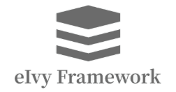

# <div style="height:40px"><div style="float:left">eIvy Framework 开发者博客</div> <div style="float:right"></img></div></div>
<<<<<<< HEAD
付振兴2020暑假学习总结.  
=======

参阅以下博客主的文章：

[付振兴](付振兴/Index.html)
>>>>>>> c72e2b72097c31af719f5c18c3ac6aa39e0eb9c8

> 区块中使用列表
> 1. 第一项
> 2. 第二项
> + 第一项
> + 第二项
> + 第三项  
* 第一项
    > 菜鸟教程  
    > 学的不仅是技术更是梦想
* 第二项
```javascript
$(document).ready(function () {
alert('付振兴的博客');
 });
```
必应网站 [bying][1]

  [1]: http://www.biying.com/
---
&emsp; &copy; eIvy Framework 2019.
