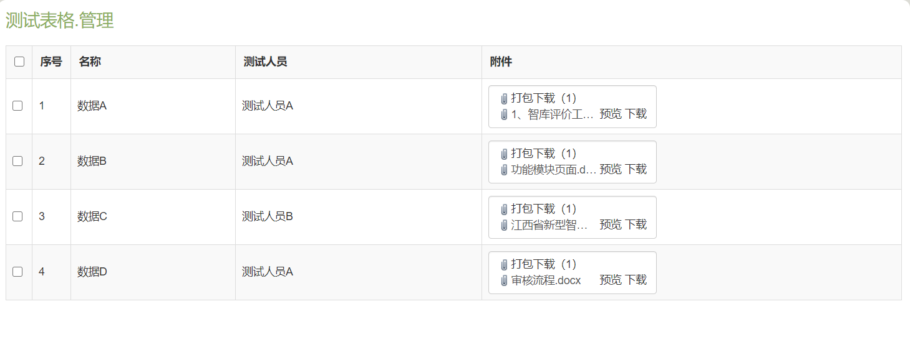
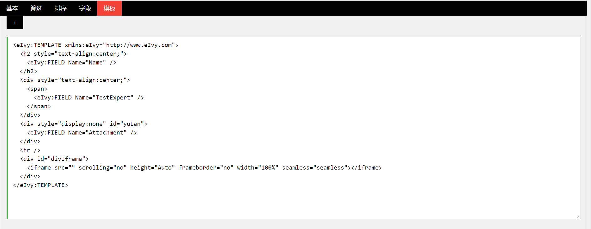
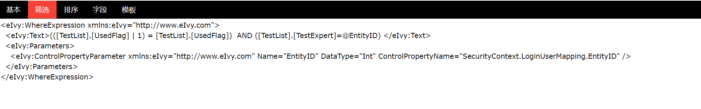
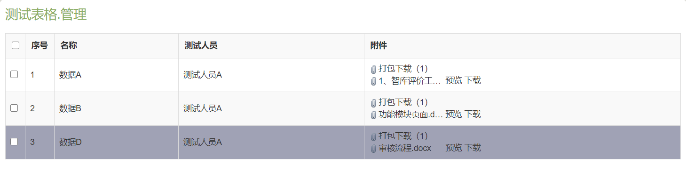
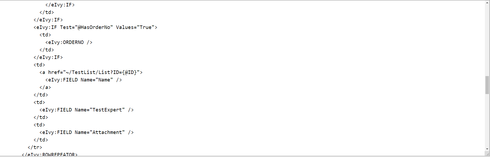
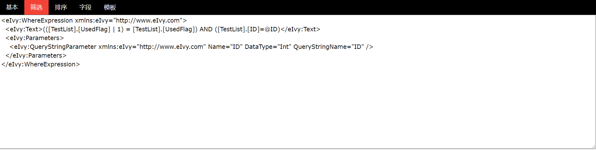

# 

eIvy Framework 开发者博客
 
</img>

## 通过数据库脚本的返回值给地址栏传参的方法
### &emsp;&emsp;在使用框架开发项目的过程中，有时我们会遇到这样的问题：需要在一次页面上只显示出数据A的详细信息，并且可以做到当用户点击页面中下一条按钮时可以跳转到下一条数据B的详细信息，该如何做到这一点呢？
### &emsp;&emsp;先在框架中新建一个测试表格并且为表格添加两个字段：名称，测试人员。
### &emsp;&emsp;为此表格新增三条数据。此时数据的显示是以表格形式显示的，如果要查看附件预览的话就需要测试人员点击才能查看，如何才能做到让测试人员点击数据名称就将需要查看的数据详情和附件以表单的形式显示？
### &emsp;&emsp;以下视图的配置由赵子龙指导完成，需要在列表视图的页面模板和视图模板中分别配置如下模板：&emsp;&emsp;其中视图模板中脚本作用是在进入页面时就将附件在iframe中展开，&lt;eIvy:FIELD/&gt;可以将表格中需要的字段显示出来。这样列表视图就变成了这种形式：
### &emsp;&emsp;为总览视图配置筛选条件，令每个测试人员只能看到自己的数据：
### &emsp;&emsp;为总览视图的模板设置字段链接，点击名称可跳转到详情显示页面：
### &emsp;&emsp;为列表视图配置筛选条件，只显示测试人员点击了名称的详情页面：
###  &emsp;&emsp;之后我们为详情显示页面配置按钮，使其可以跳转上一条数据，下一条数据和返回数据列表：配置跳转到下一条的命令按钮：用{this.PreSqlScriptOutputParameters[ID].Value.@ID}获取脚本传出的@ID并传给地址栏作为视图的筛选条件。
---
&emsp; &copy; eIvy Framework 2019.
