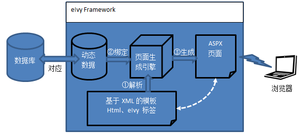

# [返回目录](../README.html)

## [概述](Index.html) - 基本思路  

&emsp;&emsp;我们可以用下图表示 eIvy Framework 的基本设计思想。

&emsp;&emsp;</img>

&emsp;&emsp;eIvy Framework 通过构造动态数据的概念与数据库对应，由页面引擎解析 XML 表示的模板，并将动态数据与模板进行绑定，生成 ASPX 页面，最终呈现给浏览器输出。eIvy Framework 设计理念是在程序运行时，生成与改变数据库结构，以及页面结构，因而框架的整个设计思路就是围绕着“动态”性展开的。传统的系统开发方式是由开发人员事先确定好数据库结构，据此做好页面，进行程序的编译、部署，然后系统才能上线运行。一旦发现有需要修改数据库结构、页面的时候，则需要重新编译、部署程序才行。eIvy Framework 则要求做到数据库结构、页面布局都是可以在系统运行时进行热修改的。这其实有些 DevOps 的概念了，即开发与部署是无缝衔接的。  

---
&emsp; &copy; eIvy Framework 2019.
