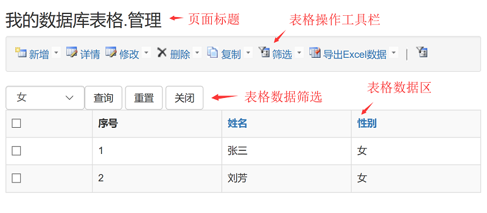
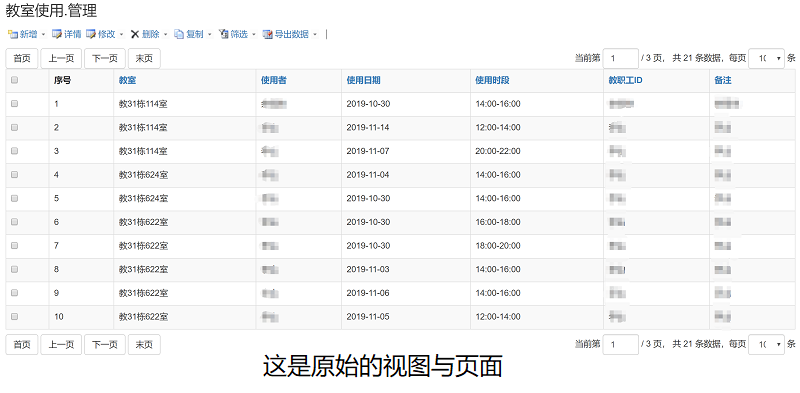
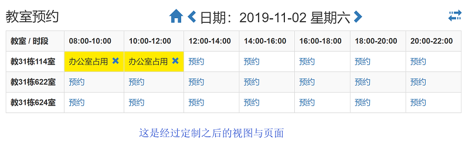

# [返回目录](../README.html)

## [概述](Index.html) - 核心概念  

&emsp;&emsp;eIvy Framework 的最核心概念就是数据库的表格。具体包括：  

* 动态数据表格(Dynamic Data Table)
* 动态数据页面(Dynamic Data Page)
* 动态数据视图(Dynamic Data View)
* 命令(Command)

&emsp;&emsp;之所以称之为“动态数据”，是因为：(1) 数据库表格的结构是可以在系统运行期间，在线修改的；(2) 界面及操作功能通过为字段指定类型，即可动态生成。

### 1. 动态数据表格  

&emsp;&emsp;对应着数据库的表格。而表格是由字段构成的，可以通过在线工具创建表格及其字段，通过为字段指定类型(Field Form)，即可构建出基于该表格的 CRUD 应用。我们通过以下视频了解这一过程。  

&emsp;&emsp;<video controls="controls" preload="none" width="380" height="260" src="Video/2019110201.mp4">
</video>

### 2. 动态数据页面

&emsp;&emsp;框架为每个动态数据表格配备相关的操作页面，这些页面即为动态数据页面。一般一个动态数据表格包括：列表页面(List)，新增页面(NewForm)，修改页面(EditForm)，回收站页面(Recycle)，导入数据页面(ImportData)五个基本的动态数据页面。这五个页面对应着表格的五个视图(View)，用于完成表格数据的 CRUD 操作。动态数据页面的基本构成如下图所示。

&emsp;&emsp;</img>

### 3. 动态数据视图

&emsp;&emsp;动态数据视图是连接动态数据表格和动态数据页面的桥梁。通过动态数据视图将表格中的数据经过初步筛选和排序之后以页面元素的形式呈现。它既是数据元素又是页面元素。通过视图可以按需定制出基于动态数据表格的各种各样的界面。例如下面两个对照图就展示了这种定制能力。

&emsp;&emsp;</img>
 
&emsp;&emsp;</img>

### 4. 命令

&emsp;&emsp;命令是完成系统功能的最核心的对象，以工具栏与命令按钮的形成呈现给用户，进行功能交互。框架内置了很多命令，提供给开发者使用。同时通过将数据库脚本绑定在命令对象上，扩展出更加丰富的定制化功能，以满足业务需求。具体的命令可以查看[命令参考](Chapter10/Sec06.html)。

---
&emsp; &copy; eIvy Framework 2019.
