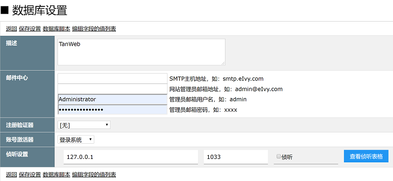

# [返回目录](../README.html)

## [数据库](Index.html) - 数据库基本配置  

&emsp;&emsp;以下是 eIvy Framework 数据库配置页及其各项配置说明。

</img>

|配置项|说明|
|---|---|
|描述|对当前数据库的一般性描述|
|邮件中心|为当前应用发送系统邮件配置的电子邮箱，可以指定任何支持 SMTP 协议的邮箱|
|注册验证器|用户在注册账号的时候，需要提供用于验明真实身份的信息及其方式，目前包括：实体注册验证、验证码注册验证，具体参见[注册验证器](Sec12.html)|
|账号激活器|用户在注册账号之后，其账号生效的方式，目前包括：登录系统、邮件激活、管理员审核，具体参见[账号激活器](Sec13.html)|
|侦听设置|对数据库表格发生变化的时候，系统主动做出响应，具体参见[表格侦听](Sec10.html)|

---
&emsp; &copy; eIvy Framework 2019.
