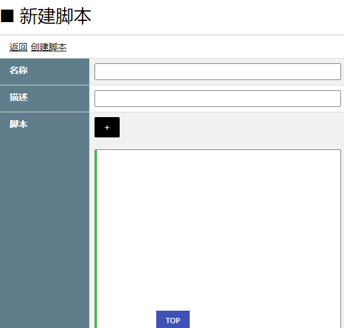

# [返回目录](../README.html)

## [数据库](Index.html) - 数据库脚本创建  

&emsp;&emsp;数据库脚本（SQL Script）是一段 SQL，不同于存储过程，这段 SQL 在每次请求执行的时候（如：命令按钮的前置与后置数据库脚本）以动态方式执行。

### **创建**

&emsp;&emsp;系统设置后台->数据库->数据库脚本->新增脚本

</img>

&emsp;&emsp;任何合法的 SQL 语句都可以写在脚本中。

### **参数**

&emsp;&emsp;数据库脚本一定需要有参数，分为传入参数、传出参数。

&emsp;&emsp;传入参数：无需在数据库脚本中显式定义，凡是出现了 @ 标注的标识符，框架都会认定为传入参数。例如：

```sql
SELECT *
FROM Contacts
WHERE Name = @Name
```

&emsp;&emsp;上述脚本中 @Name 并没有通过 DECLARE 语句显式定义，但框架会将其认定为传入参数。对于所有传入参数的类型都会被认定为 sql_variant 可变类型，因此在使用的时候最好强制转换成所需的类型，例如：

```sql
SELECT *
FROM Contacts
WHERE Name = CAST(@Name AS nvarchar(20))
```

&emsp;&emsp;但是一旦在脚本中写了传入参数，一定要在调用的时候给出传入参数，否则会引起脚本调用的异常。

&emsp;&emsp;另外，所有传入参数均被作为传出参数，因此，可以在调用方通过传入参数就能够获取传出值。

### **调用**

&emsp;&emsp;目前框架调用数据库脚本有三种方式：命令按钮的前置与后置数据库脚本、页面数据库脚本、数据库脚本调用一般处理程序。

* 命令按钮的前置与后置脚本调用

&emsp;&emsp;通过命令按钮的前置数据库脚本 PreSqlScript 和 后置数据库脚本 PostSqlScript 进行调用，主要是通过配置相应属性。例如：

```xml
<eIvy:COMMANDBUTTON 
    PreSqlScriptName="TEST"
    PreSqlScriptParameters="{xx.@Name}"
/>
```

&emsp;&emsp;上述代码为命令按钮配置了前置脚本及其传入参数 @Name。实际上框架会为脚本加上默认的 @ID、@Principal 两个参数，用于传入动态数据控件选中数据行的 ID 值和当前登录用户的身份信息。有关更多内容，参见 [命令按钮的数据库脚本](../Chapter10/Page/CommandButtonSqlScript.html)。

* 页面数据库脚本

&emsp;&emsp;数据库脚本也可以脱离命令按钮，在页面加载的时候调用，有关更多内容，参见 [页面数据库脚本标签](../Chapter10/Page/SqlScriptor.html)。

* 数据库脚本调用一般处理程序

&emsp;&emsp;通过在页面的 JS 代码中调用一般处理程序也可以执行数据库脚本，有关更多内容，参见 [通过页面脚本调用数据库脚本](SqlScriptInvoker.html)。

---
&emsp; &copy; eIvy Framework 2019.
