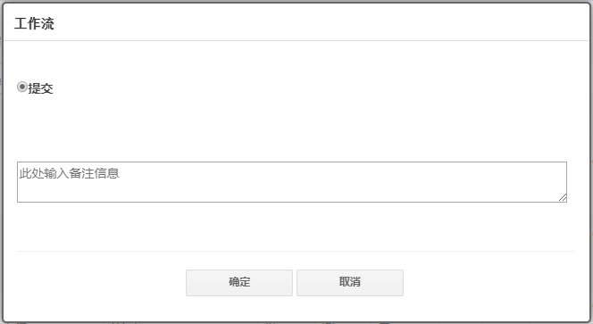

# [返回目录](../README.html)

## [工作流](Index.html) - 工作流配置  

&emsp;&emsp;工作流的配置包括了：

* 工作流定义  

* 工作流执行  

### **工作流定义**

### **工作流执行**

&emsp;&emsp;通过命令按钮可以配置专门针对工作流执行的动作按钮。具体可以看以下例子：

```xml
<eIvy:COMMANDBUTTON
    DynamicDataControlID="DDC1"
    CommandName="WorkflowExecute"
    CssClass="btn btn-primary"
    Text="审核"
    IndicatorName="WorkflowIndicator"
    ControlName="PopupCommandButton"
/>
```

&emsp;&emsp;上述标签放置在页面中，其中关键的是 CommandName 属性，用于指定命令按钮的命令为工作流执行（WorkflowExecute）。由于工作流执行命令会弹出执行框，因此命令按钮的 ControlName 属性要指定为 PopupCommandButton。如果该命令按钮在没有工作流需要执行的情况下不予显示，则配置上 IndicatorName 属性为 WorkflowIndicator。当我们点击此按钮之后，会弹出工作流执行框，如下图：

</img>

图 1 工作流命令按钮执行弹出框的效果

---
&emsp; &copy; eIvy Framework 2019.
