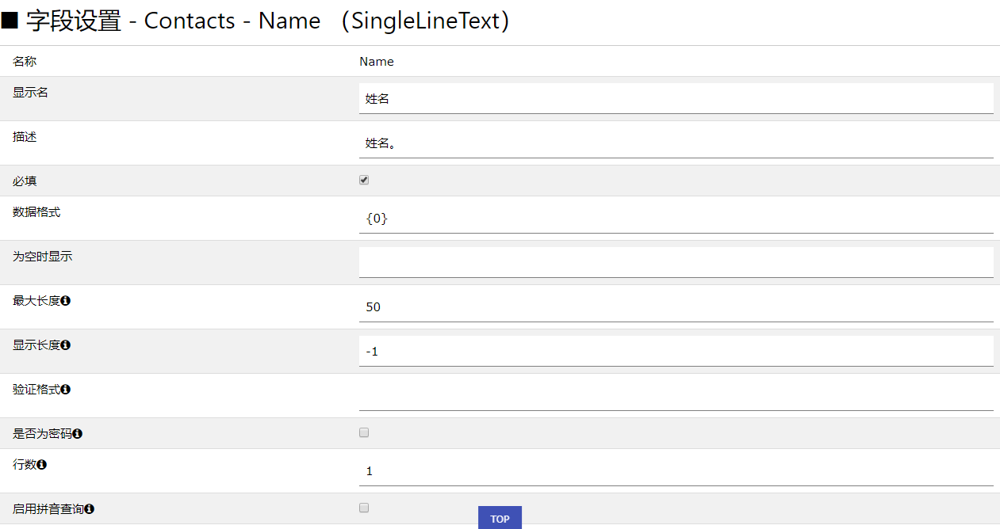
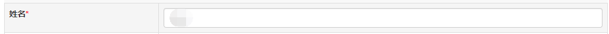

# [返回目录](../../README.html)

## [技术参考](../Index.html) - [字段型](../FieldForm.html) - 单行文本(SingleLineText)

&emsp;&emsp;单行文本（SingleLineText）：以单行文本输入框的形式呈现字段，主要解析为 Html 的 &lt;input type="text"/&gt; 标签。  

### **存储数据类型**

```sql
nvarchar(256)
```

### **主要配置属性**

|属性名|含义|默认值|说明|视图可配置|
|---|---|---|---|---|
|MaxLength|最大长度|50|文本的最大输入长度|False|
|ValidateFormat|验证格式||以正则表达式书写的验证格式|False|
|RowCount|行数|1|输入框的行数|True|
|DisplayLength|显示长度|-1|在只读模式下，文本显示的长度，如果实际文本长度超过该值，则会截断后面的文本，并以 ... 显示，默认值为 -1，表示按照实际长度显示|True|
|IsPassword|是否为密码|False|是否为密码形式输入数据|False|
|EnablePinYinSearch|启用拼音查询|False|在进行数据筛选的时候，是否可以通过输入拼音进行查询|False|

### **例子**

&emsp;&emsp;我们可以为 Contacts 表配置姓名字段为单行文本型字段，如下图：

</img>

图 1 字段配置

</img>

图 2 字段呈现效果

### **注意**

* 最大长度问题

&emsp;&emsp;配置的最大长度不能超过 256 数据库中存储的最大长度。

* 行数属性配置问题

&emsp;&emsp;虽然是单行文本字段，但在某些情况下，我们可以通过 RowCount 属性将单行变成多行，解析出的 Html 为 &lt;textarea/&gt;。

* 启用拼音查询问题

&emsp;&emsp;一旦启用拼音查询，会降低查询的性能，因此，非必要不要启用该属性。

* 验证格式问题

&emsp;&emsp;这个属性非常重要，框架虽然提供了 SQL 注入检测，但我们强烈建议应用开发者为单行文本字段配置该属性，以限定用户的输入内容，保证系统的安全。

### **筛选控件**

&emsp;&emsp;单行文本字段配套的筛选控件也为单行文本输入框，并且是模糊查询效果，在启用拼音查询的情况下，输入拼音首字母即可完成数据的检索。

---
&emsp; &copy; eIvy Framework 2019.
